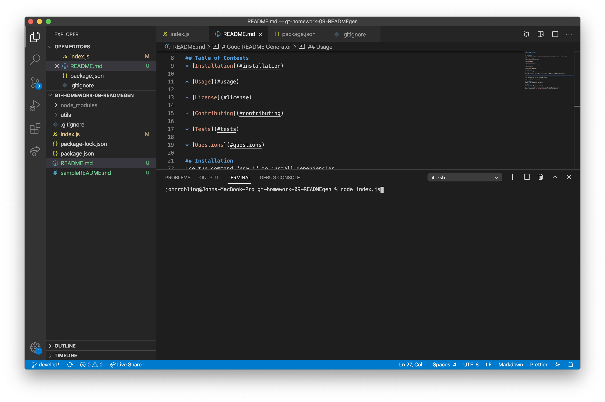
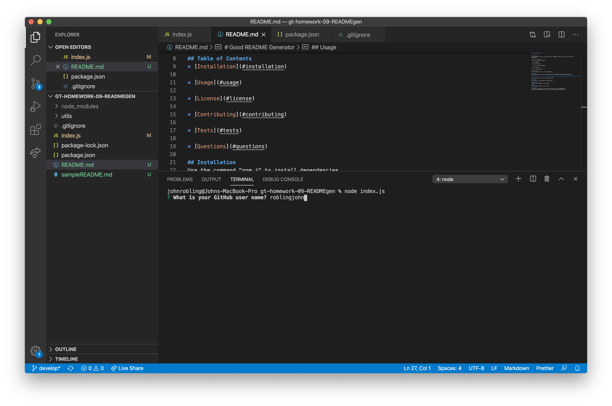
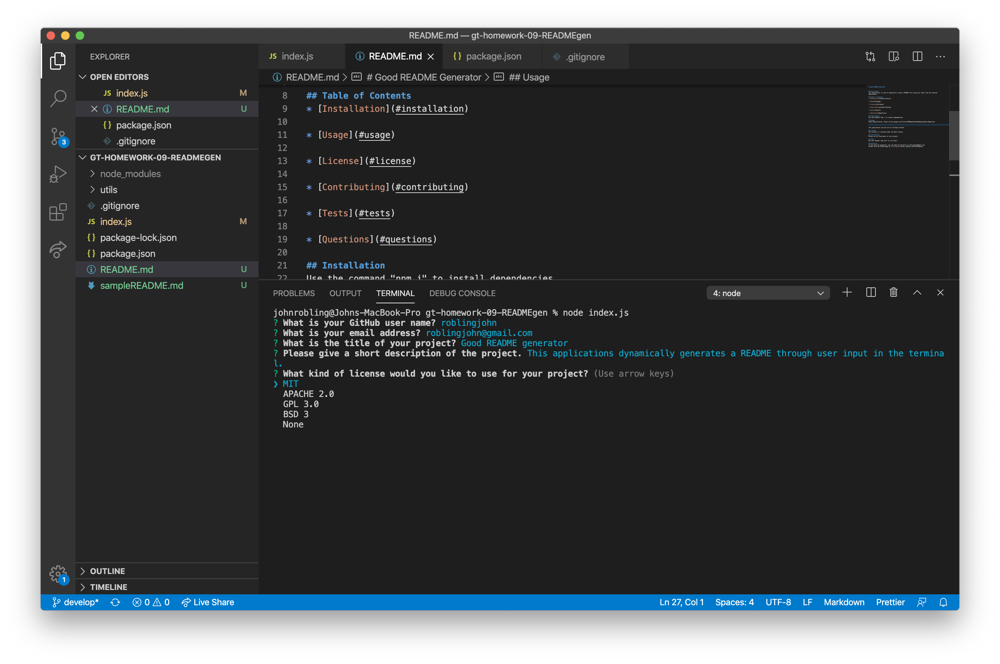
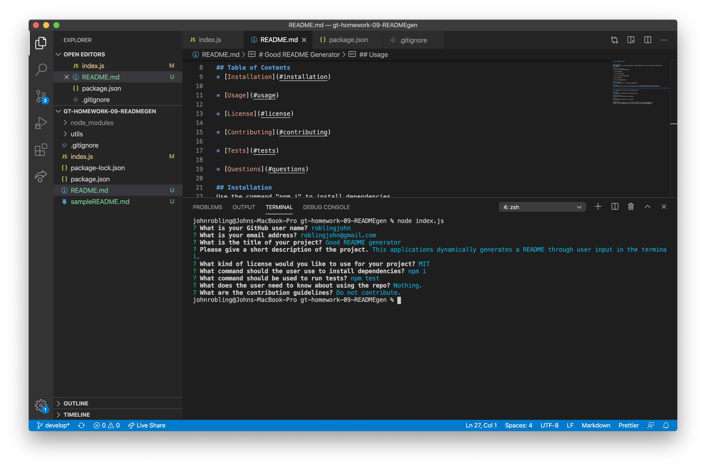

# Good README Generator

## Description
This application is used to dynamically create a README file using user input from the terminal application.

## Table of Contents
* [Installation](#installation)

* [Usage](#usage)

* [License](#license)

* [Contributing](#contributing)

* [Tests](#tests)

* [Questions](#questions)

## Installation
Use the command "npm i" to install dependencies.

## Usage
Video demonstration: https://drive.google.com/file/d/1PMBHeenwPn1IwKbe8ejp1u4Aem-nSHmq/view

This application can only be run through terminal. Enter "node index.js" to run it. After answering the prompts, you will have a README saved at sampleREADME.md.

## Contributing
Please do not contribute to this project.

## Questions
If you have any questions, you can email me directly at roblingjohn@gmail.com. 
Please visit my GitHub page at [roblingjohn](http://github.com/roblingjohn).
        